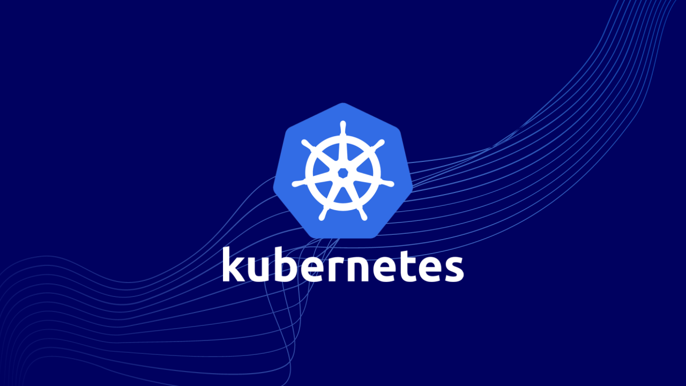
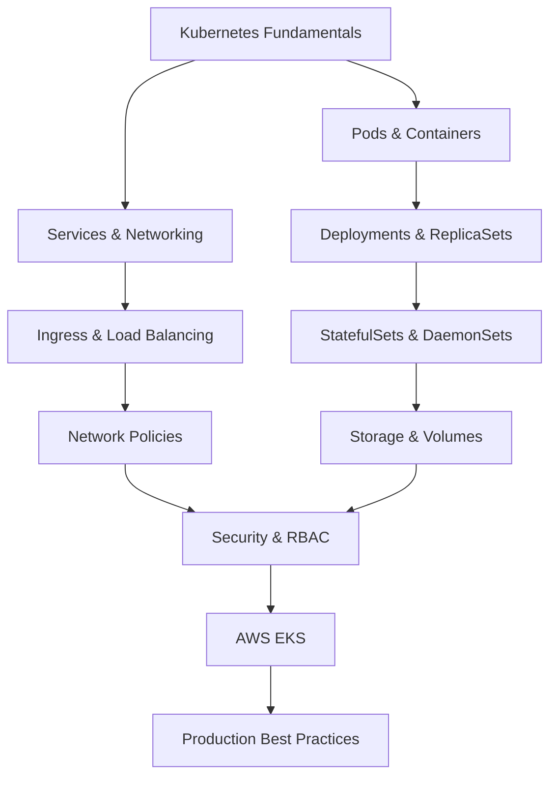

# 🚀 Kubernetes Hands On & Practice Guide



A comprehensive, hands-on training repository for learning Kubernetes from scratch to advanced level. Features real-world scenarios including AWS EKS, Terraform, Helm, and more.

## 📚 Table of Contents

- [Overview](#-overview)
- [Prerequisites](#-prerequisites)
- [Installation](#️-installation)
- [Modules](#-modules)
- [Projects](#-projects)
- [Usage](#-usage)
- [License](#-license)

## 🎯 Overview

This repository is a comprehensive learning resource designed for mastering the Kubernetes ecosystem. It covers everything from basic concepts to advanced topics:

- ✅ **Core Kubernetes Concepts** - Pods, Services, Deployments
- ✅ **Advanced Topics** - RBAC, Network Policies, Security Contexts
- ✅ **AWS EKS Integration** - Cloud-based Kubernetes management
- ✅ **Real-World Applications** - Microservice deployments
- ✅ **DevOps Tools** - Terraform, Helm, Docker
- ✅ **Best Practices** - Production-ready configurations

## 📋 Prerequisites

To use these training materials, it's recommended to have the following tools installed:

```bash
# Essential tools
- kubectl (v1.28+)
- docker (v24.0+)
- minikube or kind (for local development)

# Cloud & Infrastructure
- AWS CLI (v2+)
- eksctl (for EKS cluster management)
- terraform (v1.5+)

# Package Management
- helm (v3.12+)

# Optional
- kubectx/kubens (for context switching)
- k9s (for terminal UI)
- stern (for log aggregation)
```

## ⚙️ Installation

### 1. Clone the Repository

```bash
git clone https://github.com/your-username/kubernetes-training.git
cd kubernetes-training
```

### 2. Kubernetes Cluster Setup

#### Local Development (Minikube)

```bash
# Start Minikube
minikube start --cpus 2 --memory 4096

# Check cluster status
kubectl cluster-info
```

#### Production Cluster with AWS EKS

```bash
# Create EKS cluster with Terraform
cd create-kube-cluster-terraform
terraform init
terraform plan
terraform apply

# Alternative setup with eksctl
eksctl create cluster \
  --name my-cluster \
  --region eu-west-1 \
  --nodegroup-name standard-workers \
  --node-type t3.medium \
  --nodes 3 \
  --nodes-min 1 \
  --nodes-max 4
```

## 📖 Modules

### Beginner Level (S1-S6)

| Module | Topic                                                                               | Description                               |
| ------ | ----------------------------------------------------------------------------------- | ----------------------------------------- |
| **S1** | [Kubernetes Installation](S1-kubernetes-01-installing-on-ec2-instance)              | Setting up Kubernetes cluster on EC2      |
| **S2** | [Basic Operations](S2-kubernetes-02-basic-operations)                               | Pods, Deployments, ReplicaSets            |
| **S3** | [Network & Service Discovery](S3-kubernetes-03-networking-service-discovery)        | Services, DNS, Networking                 |
| **S4** | [Volumes](S4-kubernetes-04-pods-volumes)                                            | PersistentVolumes, PersistentVolumeClaims |
| **S5** | [Configuration Management](S5-kubernetes-05-secrets-configmap)                      | ConfigMaps, Secrets                       |
| **S6** | [Microservice Deployment](S6-kubernetes-06-microservice-deployment-and-autoscaling) | Todo App, Autoscaling                     |

### AWS & Cloud (S7-S8)

| Module     | Topic                                                                          | Description                 |
| ---------- | ------------------------------------------------------------------------------ | --------------------------- |
| **S7**     | [AWS EKS Cluster Management](S7-eks-01-managing-kubernete-cluster-with-eks)    | EKS setup, node groups, IAM |
| **S8**     | [Dynamic Volumes & Ingress](S8-eks-02-DynamicVolumeProvisionining-and-Ingress) | EBS, ALB Ingress Controller |
| **EKS-03** | [ALB Ingress Advanced](eks-03-AWS-EKS-ALB-ingress)                             | Path-based routing, SSL/TLS |

### Advanced Level (S9-S11)

| Module  | Topic                                                                    | Description                         |
| ------- | ------------------------------------------------------------------------ | ----------------------------------- |
| **S9**  | [Pod Scheduling](S9-kubernetes-12-pod-scheduling)                        | Node Selectors, Affinity, Taints    |
| **S10** | [Health Checks](S10-kubernetes-09-Liveness-Readiness-and-Startup-Probes) | Liveness, Readiness, Startup Probes |
| **S11** | [Helm Package Manager](S11-kubernetes-08-helm-basic-operations)          | Charts, Repositories, Releases      |

### Specialist Topics

| Module   | Topic                                                                            | Content                              |
| -------- | -------------------------------------------------------------------------------- | ------------------------------------ |
| **K-13** | [Resource Management](kubernetes-13-kubernetes-resource-requirements-and-limits) | CPU/Memory limits, QoS               |
| **K-14** | [Container Arguments](kubernetes-14-pods-args-and-command)                       | Command, Args, Environment           |
| **K-15** | [Network Policies](kubernetes-15-networkpolicy)                                  | Traffic control, Segmentation        |
| **K-16** | [RBAC & Security](kubernetes-16-serviceaccounts-and-RBAC-authorization)          | ServiceAccounts, Roles, RoleBindings |
| **K-17** | [Workload Controllers](kubernetes-17-daemonsets-jobs-cronjobs)                   | DaemonSets, Jobs, CronJobs           |
| **K-18** | [Multi-Container Pods](kubernetes-18-multiple&&init-container-pods)              | Sidecars, Init Containers            |
| **K-19** | [Security Contexts](kubernetes-19-security-context)                              | User/Group IDs, Capabilities         |
| **K-20** | [Deployment Strategies](kubernetes-20-blue_green-canary-deployment_strategy)     | Blue/Green, Canary                   |
| **K-21** | [Admission Controllers](kubernetes-21-Admission-Controllers)                     | Validation, Mutation                 |
| **K-22** | [Custom Resources](kubernetes-22-customresourcedefinitions)                      | CRDs, Operators                      |
| **K-24** | [Cluster Upgrades](kubernetes-24-upgrade-cluster)                                | Version migration                    |
| **K-25** | [Authentication & Authorization](kubernetes-25-Authentication-Authorization)     | User management, OIDC                |

## 🎪 Projects

### 1. Todo Application (Full-Stack Kubernetes Deployment)

```
S6-kubernetes-06-microservice-deployment-and-autoscaling/todo-app/
├── app/                    # Node.js Express application
├── kubernetes/            # K8s manifests
│   ├── db-deployment.yaml
│   ├── db-service.yaml
│   ├── web-deployment.yaml
│   └── web-service.yaml
├── compose/               # Docker Compose (development)
└── Dockerfile
```

**Features:**

- MongoDB backend
- Express.js frontend
- Horizontal Pod Autoscaling
- Persistent storage
- Service discovery

**Deployment:**

```bash
cd S6-kubernetes-06-microservice-deployment-and-autoscaling/todo-app
kubectl apply -f kubernetes/
kubectl get pods -w
```

### 2. EKS Cluster Automation with Terraform

```bash
cd create-kube-cluster-terraform
terraform init
terraform apply -auto-approve
```

**Includes:**

- VPC configuration
- EKS cluster setup
- Worker nodes autoscaling
- CloudFormation templates

## 💡 Usage

### Basic Commands

```bash
# Cluster information
kubectl cluster-info
kubectl get nodes

# Pod management
kubectl get pods
kubectl describe pod <pod-name>
kubectl logs <pod-name>
kubectl exec -it <pod-name> -- /bin/bash

# Deployment management
kubectl apply -f deployment.yaml
kubectl get deployments
kubectl scale deployment <n> --replicas=3
kubectl rollout status deployment/<n>

# Service management
kubectl get services
kubectl expose deployment <n> --port=80 --type=LoadBalancer

# Namespace management
kubectl create namespace <n>
kubectl get namespaces
kubectl config set-context --current --namespace=<n>
```

### Advanced Commands

```bash
# Resource monitoring
kubectl top nodes
kubectl top pods

# Network debugging
kubectl run tmp-shell --rm -i --tty --image nicolaka/netshoot

# Secrets management
kubectl create secret generic my-secret --from-literal=password=secret123
kubectl get secrets

# RBAC verification
kubectl auth can-i create deployments --namespace=default
kubectl auth can-i delete pods --as=system:serviceaccount:default:my-sa

# Logging and monitoring
kubectl logs -f deployment/my-app
stern my-app  # All pod logs
```

## 📊 Learning Roadmap



## 🎓 Best Practices

### 1. Resource Management

```yaml
resources:
  requests:
    memory: "64Mi"
    cpu: "250m"
  limits:
    memory: "128Mi"
    cpu: "500m"
```

### 2. Health Checks

```yaml
livenessProbe:
  httpGet:
    path: /health
    port: 8080
  initialDelaySeconds: 30
  periodSeconds: 10

readinessProbe:
  httpGet:
    path: /ready
    port: 8080
  initialDelaySeconds: 5
  periodSeconds: 5
```

### 3. Security

```yaml
securityContext:
  runAsNonRoot: true
  runAsUser: 1000
  fsGroup: 1000
  capabilities:
    drop:
      - ALL
```

## 🛠️ Troubleshooting

### Pod not running?

```bash
# Check events
kubectl describe pod <pod-name>

# Inspect logs
kubectl logs <pod-name> --previous

# Connect to container
kubectl exec -it <pod-name> -- /bin/sh
```

### Service unreachable?

```bash
# Check endpoints
kubectl get endpoints <service-name>

# Test network connectivity
kubectl run test --image=busybox --rm -it -- wget -O- <service-name>
```

## 🌟 Useful Resources

- [Kubernetes Official Documentation](https://kubernetes.io/docs/)
- [AWS EKS Workshop](https://www.eksworkshop.com/)
- [Helm Charts](https://artifacthub.io/)
- [Kubernetes Patterns](https://k8spatterns.io/)
- [CNCF Landscape](https://landscape.cncf.io/)

**Happy Kubernetes Learning! 🚀**
