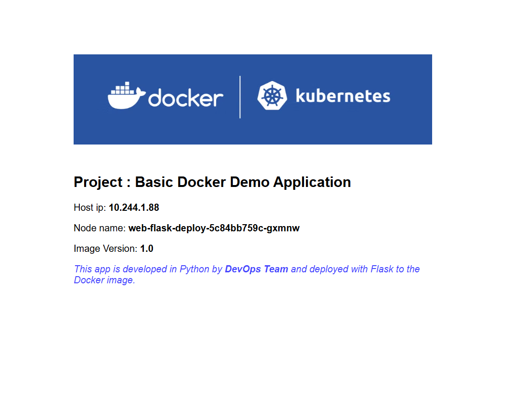

# Hands-on Kubernetes-03: Kubernetes Networking and Service Discovery

The purpose of this hands-on training is to give students the knowledge of Kubernetes Services.

## Learning Outcomes

At the end of the this hands-on training, students will be able to;

- Explain the benefits of logically grouping `Pods` with `Services` to access an application.

- Explore the service discovery options available in Kubernetes.

- Learn different types of Services in Kubernetes.

## Outline

- Part 1 - Setting up the Kubernetes Cluster

- Part 2 - Services, Load Balancing, and Networking in Kubernetes

## Part 1 - Setting up the Kubernetes Cluster

- Launch a Kubernetes Cluster of Ubuntu 22.04 with two nodes (one master, one worker) using the [Cloudformation Template to Create Kubernetes Cluster](../S2-kubernetes-02-basic-operations/cfn-template-to-create-k8s-cluster.yml). _Note: Once the master node is up and running, the worker node automatically joins the cluster._

> _Note: If you have a problem with the Kubernetes cluster, you can use this link for the lesson._
> https://killercoda.com/playgrounds

- Check if Kubernetes is running and nodes are ready.

```bash
kubectl cluster-info
kubectl get no
```

## Part 2 - Services, Load Balancing, and Networking in Kubernetes

Kubernetes networking addresses four concerns:

- Containers within a Pod use networking to communicate via loopback.

- Cluster networking provides communication between different Pods.

- The Service resource lets you expose an application running in Pods to be reachable from outside your cluster.

- You can also use Services to publish services only for consumption inside your cluster.

### Service

An abstract way to expose an application running on a set of Pods as a network service.

With Kubernetes, you don't need to modify your application to use an unfamiliar service discovery mechanism.

Kubernetes gives Pods their IP addresses and a single DNS name for a set of Pods, and can load-balance across them.

### Motivation

Kubernetes Pods are mortal. They are born, and when they die, they are not resurrected. If you use a Deployment to run your app, it can create and destroy Pods dynamically.

Each Pod gets its own IP address, however in a Deployment, the set of Pods running in one moment in time could be different from the set of Pods running that application a moment later.

### Service Discovery

The basic building block starts with the Pod, which is just a resource that can be created and destroyed on demand. Because a Pod can be moved or rescheduled to another Node, any internal IPs that this Pod is assigned can change over time.

If we were to connect to this Pod to access our application, it would not work on the next re-deployment. To make a Pod reachable to external networks or clusters without relying on any internal IPs, we need another layer of abstraction. K8s offers that abstraction with what we call a `Service Deployment`.

`Services` provide network connectivity to Pods that work uniformly across clusters.
K8s services provide discovery and load balancing. `Service Discovery` is the process of figuring out how to connect to a service.

- Service Discovery is like networking your Containers.

- DNS in Kubernetes is an `Built-in Service` managed by `Kube-DNS.

- DNS Service is used within PODs to find other services running on the same Cluster.

- Multiple containers running within the same POD don’t need DNS service, as they can contact each other.

- Containers within the same POD can connect to other containers using `PORT` on `localhost`.

- To make DNS work, POD always needs a `Service Definition`.

- Kube-DNS is a database containing key-value pairs for lookup.

- Keys are names of service,s and values are IP addresses on which those services are running.

### Defining and Deploying Services

- Let's define a setup to observe the behavior of `services` in Kubernetes and how they work in practice.

- Create a folder and name it service-lessons.

```bash
mkdir service-lessons
cd service-lessons
kubectl get no
```

- Create a `yaml` file named `web-flask.yaml` and explain its fields.

https://kubernetes.io/docs/concepts/workloads/controllers/deployment/
https://kubernetes.io/docs/reference/kubernetes-api/workload-resources/deployment-v1/

```bash
kubectl api-resources
```

```yaml
apiVersion: apps/v1 #  kubectl api-resources
kind: Deployment
metadata:
  name: web-flask-deploy
  labels:
    env: dev
spec:
  replicas: 3
  selector:
    matchLabels:
      app: web-flask
  template:
    metadata:
      labels:
        app: web-flask
    spec:
      containers:
        - name: web-flask-pod
          image: ondiacademy/cw_web_flask1
          ports:
            - containerPort: 5000
```

- Create the web-flask Deployment.

```bash
kubectl apply -f web-flask.yaml
kubectl apply -f .
```

- Show the Pods detailed information and learn their IP addresses:

```bash
kubectl get pods -o wide  # on worker Node
k get po -A               # All Pods on worker and master Nodes
k get po -A -o wide
```

- We get an output like below.

```bash
NAME                                READY   STATUS    RESTARTS   AGE   IP           NODE          NOMINATED NODE   READINESS GATES
web-flask-deploy-5b59bc685f-2cwc2   1/1     Running   0          78s   10.244.1.5   kube-worker   <none>           <none>
web-flask-deploy-5b59bc685f-b92fr   1/1     Running   0          78s   10.244.1.4   kube-worker   <none>           <none>
web-flask-deploy-5b59bc685f-r2tb9   1/1     Running   0          78s   10.244.1.3   kube-worker   <none>           <none>
```

In the output above, for each Pod the IPs are internal and specific to each instance. If we were to redeploy the application, then each time a new IP will be allocated.

We now check that we can ping a Pod inside the cluster.

- Create a `forcurl.yaml` file to create a Pod that pings a Pod inside the cluster.

https://kubernetes.io/docs/concepts/workloads/pods/

```yaml
apiVersion: v1
kind: Pod
metadata:
  name: forcurl
spec:
  containers:
    - name: forcurl
      image: ondiacademy/forping
      imagePullPolicy: IfNotPresent #https://kubernetes.io/docs/concepts/containers/images/
  restartPolicy: Always #https://kubernetes.io/docs/concepts/workloads/pods/pod-lifecycle/#restart-policy
```

- Create a `forcurl` pod and log into the container.

```bash
kubectl apply -f forcurl.yaml
kubectl get pods
kubectl exec -it forcurl -- sh
/ # ping -c 3 10.244.1.3
  # curl 10.244.1.3:5000
  # exit
```

- Show the Pods detailed information and learn their IP addresses again.

```bash
kubectl get pods -o wide
```

- Scale the deployment down to zero.

```bash
kubectl scale deploy web-flask-deploy --replicas=0
```

- List the pods again and note that there is no pod in web-flask-deploy.

```bash
kubectl get pods -o wide
```

- Scale the deployment up to three replicas.

```bash
kubectl scale deploy web-flask-deploy --replicas=3
```

- List the pods again and note that the pods have changed.

```bash
kubectl get pods -o wide
```

- Get the documentation of `Services` and its fields.

```bash
kubectl explain svc
```

- Create a `web-svc.yaml` file with the following content and explain its fields.

- https://kubernetes.io/docs/concepts/services-networking/service/

```yaml
apiVersion: v1
kind: Service
metadata:
  name: web-flask-svc
  labels:
    env: dev
spec:
  type: ClusterIP # default - internal traffic
  ports:
    - port: 3000 # service port
      targetPort: 5000 # container port
  selector:
    app: web-flask # same label with web-flask deployment
```

```bash
kubectl apply -f web-svc.yaml
```

- List the services.

```bash
kubectl get svc -o wide
```

```bash
NAME            TYPE        CLUSTER-IP      EXTERNAL-IP   PORT(S)                  AGE     SELECTOR
kubernetes      ClusterIP   10.96.0.1       <none>        443/TCP                  4h39m   <none>
web-flask-svc   ClusterIP   10.98.173.110   <none>        3000/TCP                 28m     app=web-flask
```

- Display information about the `web-flask-svc` Service.

```bash
kubectl describe svc web-flask-svc
```

```bash
Name:              web-flask-svc
Namespace:         default
Labels:            env=dev
Annotations:       <none>
Selector:          app=web-flask
Type:              ClusterIP
IP Family Policy:  SingleStack
IP Families:       IPv4
IP:                10.109.125.55
IPs:               10.109.125.55
Port:              <unset>  3000/TCP
TargetPort:        5000/TCP
Endpoints:         10.244.1.7:5000,10.244.1.8:5000,10.244.1.9:5000
Session Affinity:  None
Events:            <none>
```

- Go to the pod and ping the deployment that has service with ClusterIP and see the ip address of service.

```bash
kubectl exec -it forcurl -- sh
/ # curl <IP of service web-flask-svc>:3000
/ # curl web-flask-svc:3000
/ # ping -c 2 web-flask-svc # There is no ping for services
/
```

- As we see, Kubernetes services provide DNS resolution.

### NodePort

- Change the service type of web-flask-svc service to NodePort to use the Node IP and a static port to expose the service outside the cluster. So we get the YAML file below.

```yaml
apiVersion: v1
kind: Service
metadata:
  name: web-flask-svc
  labels:
    env: dev
spec:
  type: NodePort
  ports:
    - port: 3000
      targetPort: 5000
  selector:
    app: web-flask
```

- Configure the web-flask-svc service via the apply command.

```bash
kubectl apply -f web-svc.yaml
```

- List the services again. Kubernetes exposes the service in a random port within the range 30000-32767 using the Node’s primary IP address.

```bash
kubectl get svc -o wide
```

```bash
kubectl exec -it forcurl -- sh
/ # curl <IP of service web-flask-svc>:3000
/ # ping web-flask-svc  # There is no ping for services
/ # curl web-flask-svc:3000
```



- We can visit `http://<public-node-ip>:<node-port>` and access the application. Pay attention to load balancing.
  Note: Do not forget to open the Port `<node-port>` in the security group of your node instance.

- We can also define NodePort by adding a nodePort number to the service YAML file. Check the below.

```yaml
apiVersion: v1
kind: Service
metadata:
  name: web-flask-svc
  labels:
    env: dev
spec:
  type: NodePort
  ports:
    - nodePort: 30036
      port: 3000
      targetPort: 5000
  selector:
    app: web-flask
```

- Configure the web-flask-svc service again via the apply command.

```bash
kubectl apply -f web-svc.yaml
```

- List the services and notice that the nodeport number is 30036.

```bash
kubectl get svc -o wide
```

- We can visit `http://<public-node-ip>:30036` and access the application.

### Endpoints

As Pods come and go (scaling up and down, failures, rolling updates, etc.), the Service dynamically updates its list of Pods. It does this through a combination of the label selector and a construct called an Endpoint object.

Each Service that is created automatically gets an associated Endpoint object. This Endpoint object is a dynamic list of all of the Pods that match the Service’s label selector.

Kubernetes is constantly evaluating the Service’s label selector against the current list of Pods in the cluster. Any new Pods that match the selector get added to the Endpoint object, and any Pods that disappear get removed. This ensures the Service is kept up-to-date as Pods come and go.

- Get the documentation of `Endpoints` and its fields.

```bash
kubectl explain ep
```

- List the Endpoints.

```bash
kubectl get ep -o wide
k describe svc web-flask-svc
kubectl get ep -o wide

```

- Scale the deployment up to ten replicas and list the `Endpoints`.

```bash
kubectl scale deploy web-flask-deploy --replicas=10
```

- List the `Endpoints` and explain that the Service has an associated `Endpoint` object with an always-up-to-date list of Pods matching the label selector.

```bash
k get po
kubectl get ep -o wide

```

- The Endpoint object automatically updates its rules when new endpoints appear.
- The Endpoint object gets the new endpoints rules from kube-proxy.

```bash
kubectl scale deploy web-flask-deploy --replicas=0

kubectl scale deploy web-flask-deploy --replicas=3
k get po
kubectl get ep -o wide
k describe svc web-flask-svc

```

- You can see all the endpoints are updated now.

> Open a browser on any node and explain the `loadbalancing` via browser. (Pay attention to the host IP and node name, and note that `host ips` and `endpoints` are the same)
>
> http://[public-node-ip]:[node-port]

### Connecting to a service on a different namespace

- Kubernetes has an add-on for DNS, which creates a DNS record for each Service, and its format is:

`web-svc.my-namespace.svc.cluster.local`

- Services within the same Namespace find other Services just by their names.

- Let's understand this issue with an example.

- First of all, removethe whole deployment and service from the default namespace

```bash
kubectl delete -f .
```

- Create a namespace and name it `demo`.

```bash
k get ns
kubectl create namespace demo
```

## Note

- For a single object file:
  kubectl apply -f web-flask.yaml -n demo

- When you have more than one file, you can specify the namespace in the metadata field of each file.

## Note

- Not all Kubernetes objects belong to a specific namespace, and you can see them with this command:

```bash
kubectl api-resources
```

- Update the `web-flask.yaml` file as below.

```yaml
apiVersion: apps/v1
kind: Deployment
metadata:
  name: web-flask-deploy
  labels:
    env: dev
  namespace: demo
spec:
  replicas: 3
  selector:
    matchLabels:
      app: web-flask
  template:
    metadata:
      labels:
        app: web-flask
    spec:
      containers:
        - name: web-flask-pod
          image: ondiacademy/cw_web_flask1
          ports:
            - containerPort: 5000
```

- Update the `web-svc.yaml` file as below.

```yaml
apiVersion: v1
kind: Service
metadata:
  name: web-flask-svc
  namespace: demo
  labels:
    env: dev
spec:
  type: NodePort
  ports:
    - port: 3000
      targetPort: 5000
      nodePort: 30036
  selector:
    app: web-flask
```

- create deployment and service

```bash
kubectl apply -f .
```

- show all namespaces

```bash
kubectl get ns
k get po
k get po -n demo
k get po -A
```

- Lets see the all objects within demo namespace and default namespace

```bash
kubectl get deploy -n demo
kubectl get pod -n demo
kubectl get svc -n demo
kubectl get pod
kubectl get svc
```

- log into the container and curl the `web-flask-svc` inside `demo` namespace.

## Note

- Services within the same Namespace find other Services just by their names.
  but
- Services in other namespaces: access with serviceName.namespaceName.

```bash

kubectl exec -it forcurl -- sh
/ # curl web-flask-svc.demo:3000

or we can use `FQDN`.

/ #  curl web-flask-svc.demo.svc.cluster.local:3000
```

- Delete all objects.

```bash
kubectl delete -f .


```
