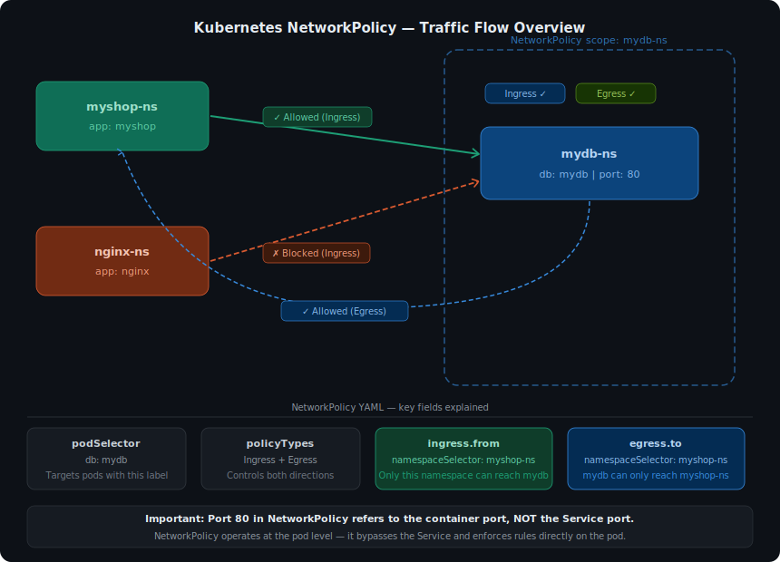

# Hands-on Kubernetes-15 : Kubernetes NetworkPolicy

The purpose of this hands-on training is to give students the knowledge of Kubernetes NetworkPolicy.

## Learning Outcomes

At the end of this hands-on training, students will be able to;

- Explain the etcd.

- Take a cluster backup.

- Restore cluster from backup.

## Outline

- Part 1 - Setting up the Kubernetes Cluster

- Part 2 - Outline of the Hands-on Setup

- Part 3 - NetworkPolicy Object

## Part 1 - Setting up the Kubernetes Cluster

- Launch a Kubernetes Cluster of Ubuntu 20.04 with two nodes (one master, one worker) using the [Terraform files to Create Kubernetes Cluster](../create-kube-cluster-terraform/main.tf). *Note: Once the master node up and running, worker node automatically joins the cluster.*

>*Note: If you have problem with kubernetes cluster, you can use this link for lesson.*
>https://labs.play-with-k8s.com

- Check if Kubernetes is running and nodes are ready.

```bash
kubectl cluster-info
kubectl get no
```

## Part 2 - Outline of the Hands-on Setup

- If you want to control traffic flow at the IP address or port level (OSI layer 3 or 4), then you might consider using Kubernetes NetworkPolicies for particular applications in your cluster.

- The entities that a Pod can communicate with are identified through a combination of the following 3 identifiers:

  1. Other pods that are allowed (exception: a pod cannot block access to itself)
  2. Namespaces that are allowed
  3. IP blocks (exception: traffic to and from the node where a Pod is running is always allowed, regardless of the IP address of the Pod or the node)

- When defining a pod or namespace based NetworkPolicy, you use a selector to specify what traffic is allowed to and from the Pod(s) that match the selector.

- Meanwhile, when IP based NetworkPolicies are created, we define policies based on IP blocks (CIDR ranges).

### Prepare Environment

- For this study, we create 3 deployment and services in different namespaces. 
  - myshop deployment under myshop namespace
  - nginx deployment under nginx namespace
  - mydb deployment under mydb namespace

- We want to connect to the `my db` pod from the `my shop` pod, but we don't want to connect from the `nginx` pod. So, we test the networkpolicy object.

- For network policy, it requires calico. Install calico.

```bash
curl https://raw.githubusercontent.com/helm/helm/master/scripts/get-helm-4 | bash
helm version
helm repo add projectcalico https://docs.tigera.io/calico/charts
kubectl create namespace tigera-operator
helm install calico projectcalico/tigera-operator --version v3.31.4 --namespace tigera-operator
watch kubectl get pods -n calico-system
```

- Create 3 namespace.

```bash
kubectl create ns myshop-ns
kubectl create ns mydb-ns
kubectl create ns nginx-ns
```

- Create a folder named np-project.

```bash
mkdir np-project && cd np-project
```

- Create a `myshop.yaml` for myshop deployment under `myshop-ns` namespace.

```yaml
apiVersion: apps/v1
kind: Deployment
metadata:
  name: myshop-deployment
  namespace: myshop-ns
spec:
  replicas: 1
  selector:
    matchLabels:
      app: myshop
  template:
    metadata:
      labels:
        app: myshop
    spec:
      containers:
      - name: myshop
        image: ogierdag/myshop:v1
        ports:
        - containerPort: 80
---
apiVersion: v1
kind: Service   
metadata:
  name: myshop-svc
  namespace: myshop-ns
spec:
  type: ClusterIP  
  ports:
  - port: 80 
    targetPort: 80
  selector:
    app: myshop 
```

- Create a `nginx.yaml` for myshop deployment under `nginx-ns` namespace.

```yaml
apiVersion: apps/v1
kind: Deployment
metadata:
  name: nginx-deployment
  namespace: nginx-ns
spec:
  replicas: 1
  selector:
    matchLabels:
      app: nginx
  template:
    metadata:
      labels:
        app: nginx
    spec:
      containers:
      - name: nginx
        image: nginx
        ports:
        - containerPort: 80
---
apiVersion: v1
kind: Service   
metadata:
  name: nginx-svc
  namespace: nginx-ns
spec:
  type: ClusterIP  
  ports:
  - port: 80 
    targetPort: 80
  selector:
    app: nginx
```

- Create a `mydb.yaml` for myshop deployment under `mydb-ns` namespace.

```yaml
apiVersion: apps/v1
kind: Deployment
metadata: 
  name: mydb-deployment
  namespace: mydb-ns 
spec:
  replicas: 1
  selector:
    matchLabels:
      db: mydb
  template:
    metadata:
      labels:
        db: mydb
    spec:
      containers:
      - name: mydb
        image: ogierdag/mydb:v1
        ports:
        - containerPort: 80
---
apiVersion: v1
kind: Service   
metadata:
  name: mydb-svc
  namespace: mydb-ns
spec:
  type: ClusterIP  
  ports:
  - port: 80 
    targetPort: 80
  selector:
    db: mydb
```

- Create the deployments and services.

```bash
kubectl apply -f .
```

- Try to connect the pods for testing.

```bash
kubectl get pod,svc -A -o wide
kubectl -n myshop-ns exec -it myshop-deployment-6876dc9874-6gcxr -- sh
apk add curl # alpine
curl <ip of mydb pod>
curl mydb-svc.mydb-ns
exit
kubectl -n nginx-ns exec -it nginx-deployment-ff6774dc6-z2czn -- bash
curl <ip of mydb pod>
curl mydb-svc.mydb-ns
exit
```

- As we saw, we could connect to `mydb` pod from anywhere.

## Part 3 - NetworkPolicy Object

- Firstly check the labels of namespaces.

```bash
kubectl get ns --show-labels
```

- We get an output like below.

```bash
NAME              STATUS   AGE   LABELS
calico-system        Active   94m     kubernetes.io/metadata.name=calico-system,name=calico-system,pod-security.kubernetes.io/enforce-version=latest,pod-security.kubernetes.io/enforce=privileged
default              Active   9d      kubernetes.io/metadata.name=default
ingress-nginx        Active   4d15h   app.kubernetes.io/instance=ingress-nginx,app.kubernetes.io/name=ingress-nginx,kubernetes.io/metadata.name=ingress-nginx
kube-flannel         Active   9d      k8s-app=flannel,kubernetes.io/metadata.name=kube-flannel,pod-security.kubernetes.io/enforce=privileged
kube-node-lease      Active   9d      kubernetes.io/metadata.name=kube-node-lease
kube-public          Active   9d      kubernetes.io/metadata.name=kube-public
kube-system          Active   9d      kubernetes.io/metadata.name=kube-system
local-path-storage   Active   9d      kubernetes.io/metadata.name=local-path-storage
mydb-ns              Active   90m     kubernetes.io/metadata.name=mydb-ns
myshop-ns            Active   90m     kubernetes.io/metadata.name=myshop-ns
nginx-ns             Active   90m     kubernetes.io/metadata.name=nginx-ns
tigera-operator      Active   94m     kubernetes.io/metadata.name=tigera-operator
```

- Create a `network-policy.yaml` for Network Policy for `mydb` pod. So, There will be communication between `myshop` and `mydb` but `nginx` is not connect to `mydb`. We also define the outbound rules for `mydb` pod. So `mydb` just connect to any pod in a namespace with the label `kubernetes.io/metadata.name: myshop-ns`

```yaml
apiVersion: networking.k8s.io/v1
kind: NetworkPolicy
metadata:
  name: test-network-policy
  namespace: mydb-ns
spec:
  podSelector:
    matchLabels:
      db: mydb
  policyTypes:
    - Ingress
    - Egress
  ingress:
    - from:
        - namespaceSelector:
            matchLabels:
              kubernetes.io/metadata.name: myshop-ns
      ports:
        - protocol: TCP
          port: 80
  egress:
    - to:
        - namespaceSelector:
            matchLabels:
              kubernetes.io/metadata.name: myshop-ns
      ports:
        - protocol: TCP
          port: 80
```

### Notes:

- spec: NetworkPolicy spec has all the information needed to define a particular network policy in the given namespace.

- podSelector: Each NetworkPolicy includes a podSelector which selects the grouping of pods to which the policy applies. The example policy selects pods with the label "role=db". An empty podSelector selects all pods in the namespace.

- policyTypes: Each NetworkPolicy includes a policyTypes list which may include either Ingress, Egress, or both. The policyTypes field indicates whether or not the given policy applies to ingress traffic to selected pod, egress traffic from selected pods, or both. If no policyTypes are specified on a NetworkPolicy then by default Ingress will always be set and Egress will be set if the NetworkPolicy has any egress rules.

- ingress: Each NetworkPolicy may include a list of allowed ingress rules. Each rule allows traffic which matches both the from and ports sections. The example policy contains a single rule, which matches traffic on a single port, from a namespaceSelector.

- egress: Each NetworkPolicy may include a list of allowed egress rules. Each rule allows traffic which matches both the to and ports sections. The example policy contains a single rule, which matches traffic on a single port to a namespaceSelector.

- So, the example NetworkPolicy:

  - isolates "db: mydb" pods in the "mydb-ns" namespace for both ingress and egress traffic.

  - (Ingress rules) allows connections to all pods in the "mydb-ns" namespace with the label "db=mydb" on TCP port 80 from:

    - any pod in a namespace with the label "kubernetes.io/metadata.name: myshop-ns"

- Create the `NetworkPolicy` object.

```bash
kubectl apply -f network-policy.yaml
```


- Try to connect the pods for testing.

```bash
kubectl get pod,svc -A -o wide
kubectl -n myshop-ns exec -it myshop-deployment-6876dc9874-6gcxr -- sh
curl <ip of mydb pod>
curl mydb-svc.mydb-ns
exit
kubectl -n nginx-ns exec -it nginx-deployment-ff6774dc6-z2czn -- bash
curl <ip of mydb pod>
curl mydb-svc.mydb-ns
exit
```

- As we saw, we could connect to `mydb` pod from `myshop` pod, but not connected from `nginx` pod.

- Modify the `network-policy.yaml` as below.

```yaml
apiVersion: networking.k8s.io/v1
kind: NetworkPolicy
metadata:
  name: test-network-policy
  namespace: mydb-ns
spec:
  podSelector:
    matchLabels:
      db: mydb
  policyTypes:
    - Ingress
    - Egress
  ingress:
    - from:
        - ipBlock:
            cidr: 172.16.0.0/16
            except:
              - 172.16.180.0/24
        - namespaceSelector:
            matchLabels:
              kubernetes.io/metadata.name: myshop-ns
        - podSelector:
            matchLabels:
              role: frontend      
      ports:
        - protocol: TCP
          port: 80
  egress:
    - to:
        - namespaceSelector:
            matchLabels:
              kubernetes.io/metadata.name: myshop-ns
      ports:
        - protocol: TCP
          port: 80
```

### Note:

- So, this example NetworkPolicy:

  - isolates "db: mydb" pods in the "mydb-ns" namespace for both ingress and egress traffic.

  - (Ingress rules) allows connections to all pods in the "mydb-ns" namespace with the label "db=mydb" on TCP port 80 from:

    - any pod in the "mydb-ns" namespace with the label "role=frontend"
    - any pod in a namespace with the label "kubernetes.io/metadata.name: myshop-ns"
    - IP addresses in the ranges 172.16.0.0–172.16.0.255 and 172.16.2.0–172.16.255.255 (ie, all of 172.16.0.0/16 except 172.16.180.0/24)

- Apply the NetworkPolicy.

```bash
kubectl apply -f network-policy.yaml
```

- And test again.

```bash
kubectl get pod,svc -A -o wide
kubectl -n myshop-ns exec -it myshop-deployment-6876dc9874-6gcxr -- sh
curl <ip of mydb pod>
curl mydb-svc.mydb-ns
exit
kubectl -n nginx-ns exec -it nginx-deployment-ff6774dc6-z2czn -- bash
curl <ip of mydb pod>
curl mydb-svc.mydb-ns
exit
```

- It doesn't matter anything. Because there is `or` logic is valid. It means any of these three conditions exists, you can connect to the `mydb pod`.

- This time we will use `namespaceSelector and podSelector` policy.
  - A single to/from entry that specifies both namespaceSelector and podSelector selects particular Pods within particular namespaces. Be careful to use correct YAML syntax.

- Modify the `network-policy.yaml` as below.

```yaml
apiVersion: networking.k8s.io/v1
kind: NetworkPolicy
metadata:
  name: test-network-policy
  namespace: mydb-ns
spec:
  podSelector:
    matchLabels:
      db: mydb
  policyTypes:
    - Ingress
    - Egress
  ingress:
    - from:
        - namespaceSelector:  
            matchLabels:
              kubernetes.io/metadata.name: myshop-ns
          podSelector:
            matchLabels:
              role: frontend      
      ports:
        - protocol: TCP
          port: 80
  egress:
    - to:
        - namespaceSelector:
            matchLabels:
              kubernetes.io/metadata.name: myshop-ns
      ports:
        - protocol: TCP
          port: 80
```

#### Note: 
This policy, contains a single from element allowing connections from Pods with the label `role: frontend` in namespaces with the label `kubernetes.io/metadata.name: myshop-ns`. So, there is `and` logic is valid. 

- Apply the NetworkPolicy.

```bash
kubectl apply -f network-policy.yaml
```

- And test again.

```bash
kubectl get pod,svc -A -o wide
kubectl -n myshop-ns exec -it myshop-deployment-6876dc9874-6gcxr -- sh
curl <ip of mydb pod>
curl mydb-svc.mydb-ns
exit
```

- This time it doesn't work. Because there must be a pod labeled with `role: frontend` under the namespace labled with `kubernetes.io/metadata.name: myshop-ns`. 

- Add `role: frontend` label to `spec.template.metadata.labels` field in the `myshop.yaml` file and try again. So, we can connect the `mydb` pod from `myshop` pod.

- Apply the `myshop.yaml`.

```bash
kubectl apply -f myshop.yaml
```

- And test again.

```bash
kubectl get pod,svc -A -o wide
kubectl -n myshop-ns exec -it myshop-deployment-6876dc9874-6gcxr -- sh
curl <ip of mydb pod>
curl mydb-svc.mydb-ns
exit
```

- This time it works.